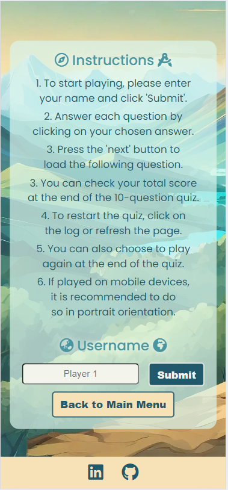

# GeoQuiz | a Geography Quiz for all ages and backgrounds


[Visit my PP2 web application here](https://hpesciotti.github.io/GeoQuiz/index.html)


## CONTENTS  

1. [Introduction](#1-introduction)

2. [UX Design](#2-ux-design)

    2.1. [Strategy](#21-strategy)

    2.2. [User Stories](#22-user-stories)
    
    2.3. [Wireframes](#23-wireframes)

    2.4. [Design](#24-design)

3. [Features](#3-features)

    3.1. [Existing Features](#31-existing-features)

    3.2. [Future Features](#32-future-features)

4. [Technologies Used](#4-technologies-used)

    4.1. [Languages Used](#41-languages-used)

    4.2. [Frameworks, Libraries & Programs Used](#42---frameworks-libraries-technologies--programs-used)

5. [Testing](#5-testing)

    5.1. [Further Testing](#51-futher-testing)

    5.2. [Bugs and Fixes](#52-bugs--fixes)

    5.3. [Unsolved Bugs](#53-unsolved-bugs)

6. [Deploymente](#6-deployment)

    6.1. [Forking the Github Repository](#61-forking-the-github-repository)

    6.2. [Github Pages](#62-github-pages)

    6.3. [Making a Local Clone](#63-making-a-local-clone)

7. [Credits](#7-credits)


## **1. Introduction**

This Front-End web application is a quiz designed to test your geographical knowledge through a colourful and fun interface. The quiz, PP2 project of diploma in Full Stack Software Development by Code Institute, was designed to demonstrate proficiency with the front-end languages HTML, CSS, and JavaScript, especially the latter. 

The choice of a geography-themed quiz is deeply personal, stemming from my academic background in Geography (bachelor's degree). Before my journey to Ireland, I spent 12 years as an environmental analyst. Thus, this project is a unique fusion of my academic knowledge and newfound coding skills.

In principle, the quiz is comprised of questions that test the general notions of this area of knowledge without involving the memorization of capitals, flag colours or the names of countries. Part of the questions were designed by me, seeking to address 

The application features a dynamic leaderboard section where users can record their best performance in the game. The quiz randomly selects ten questions from a database, each with four randomized answer options, ensuring a unique experience with every play. The leaderboard serves as a motivator, encouraging users to improve their scores and compete with others.

[Back to top](https://github.com/hpesciotti/GeoQuiz?tab=readme-ov-file#geoquiz--a-geography-quiz-for-all-ages-and-backgrounds)

## **2. UX Design**

### **2.1. Strategy**

In the app's planning stage, I visited some websites with web applications that dealt with general geography issues, such as country capitals, landmarks, etc. However, I didn't find any of these quick quiz sites with more academically accurate content. So, I opted for a database of questions from the Brazilian vestibular exam (corresponding to the Irish leaving cert exam). I adapted most of the questions and inserted some others that would better portray Ireland's natural and geopolitical landscape. 

During my research, I came across websites that listed questions on a single page, which didn't align with the projects discussed in our weekly scrums. In one of these meetings, I shared my choice for PP2 with our cohort facilitator. She introduced us to the Geography for Kids project, a collaborative effort led by Deeksa Varma, which served as a valuable reference for our project. 

As a personal note, while analyzing the Geography for Kids project code, I noticed it was complex compared to the other app samples. Through a search on GitHub, I confirm that a person with a good background in the field developed it, which contrasts with my background of almost no coding experience before enrolling in Code Institute's course. The complexity ultimately led me to intensify my immersion in JavaScript and improve my skills.

The app is aimed at people of all ages and backgrounds, but it's best suited to people who have already completed elementary school. It also aims to create a ludic playful and colourful environment that introduces the user to the main themes of geography, such as Geopolitics, Climatology, Carthography, Landforms, and Biogeography. 

Responsibility is essential for the app as it allows users to access the quiz from various devices. Finally, the high score/leaderboard system gives greater engagement by generating competition between friends and potential users. 

#### **Sites that I took inspriration for my project**

- [Geography for Kids](https://deeksha-varma.github.io/portfolio_project_2/)

- [Exercícios de Geografia(Geography Questions)](https://exercicios.brasilescola.uol.com.br/exercicios-geografia)

- [GreatStack's video tutorial](https://www.youtube.com/watch?v=PBcqGxrr9g8)

[Back to top](https://github.com/hpesciotti/GeoQuiz?tab=readme-ov-file#geoquiz--a-geography-quiz-for-all-ages-and-backgrounds)

### **2.2. User Stories**

#### **First Time Visitor Goals**
- I want to navigate through the pages easily and have a good user interface.
- I want to feel challenged and amazed by the quiz.
- I want to get my score in an easy-to-read format.

#### **Returning Visitor Goals**
- I want to check the leaderboard.
- I want to get different questions (randomized shuffle of the data bank).

#### **Frequent User Goals**
- I want to set a highscore, compete for number 1 in the leaderboard.
- I want to get to answer different questions.
- I want to see new features.

[Back to top](https://github.com/hpesciotti/GeoQuiz?tab=readme-ov-file#geoquiz--a-geography-quiz-for-all-ages-and-backgrounds)

### **2.3. Wireframes**

I generated the preliminary web application wireframes utilizing Balsamiq. I had yet to finalize the colour scheme at this stage of the project's conception. Therefore, I focused solely on establishing the foundational elements of features and web application flow.

In this sense, I have identified three essential stages for the app to meet the user stories requirements, which I have appointed as: 
- intro - "landing page" with the instructions and a form section to get the player name.
- game - the section of the game in which the questions and answer options would be displayed.
- score - showing how many questions were answered correctly and accompanied by a message that would reflect the score and an option to pay for the game again.

#### **Desktop/Laptop/Tablet Version**

-   [Intro](docs/documentation/wireframe-balsamic-geoquiz-intro-page-larger-screens.jpg)

-   [Game](docs/documentation/wireframe-balsamic-geoquiz-game-page-larger-screens.jpg)

-   [Score](docs/documentation/wireframe-balsamic-geoquiz-score-page-larger-screens.jpg)

#### **Mobile Version**

-   [Intro](docs/documentation/wireframe-balsamic-geoquiz-intro-page-mobile.jpg)

-   [Game](docs/documentation/wireframe-balsamic-geoquiz-game-page-mobile.jpg)

-   [Score](docs/documentation/wireframe-balsamic-geoquiz-score-page-mobile.jpg)

[Back to top](https://github.com/hpesciotti/GeoQuiz?tab=readme-ov-file#geoquiz--a-geography-quiz-for-all-ages-and-backgrounds)

### **2.4. Design**

#### **Imagery**

The site's background image was obtained through Adobe Firefly AI Image Generator application. The generative AI, based on a prompt indicating the colour palette, the illustration style, and the elements to be displayed, returned the [image](assets/images/background-image.webp) present in the application. Furthermore, the image was compressed and convert to webp.

[Back to top](https://github.com/hpesciotti/GeoQuiz?tab=readme-ov-file#geoquiz--a-geography-quiz-for-all-ages-and-backgrounds)

#### **Colour Scheme**

The colour scheme chosen is inspired by hues found in nature but in more vivid tones. The colour # f7e2b7 designates the yellow of sand or dirt, the blue of lakes is represented by the colour #20596c, the green of forests is present in the colour #a4dbb1, and the blue of glaciers is represented through #daf5ec.


The selection of text and background took into consideration the contrast ratio of at least Level AA. [EightShape contrast grid](docs/documentation/contrast-grid.png) is present in the documentation. The white fonts with [drop-shadow](docs/documentation/drop-shadow-typography.png) present on the user name and leaderbord are not classified as AAA or AA, but the colour used on the drop-shadow effect are, highliting the letters from the background.

Moreover, regarding the drop shadow effect, I tried to get a score superior to 5 on Adobe Color.  The following chart displays some changes to the drop-shadow colours aiming for better readability.
- Drop-shadow  - chosen color

|	Element	|	Previous	|	Final	|
|	 :----	|	  :----	|	  :------------:|
|	Drop-Shadow username	|	[AA contrast ratio 8.48:1](docs/documentation/adobe_color_enhance_contrast_5.png)	|	-	|
|	Drop-Shadow correct answer	|	[AA contrast ratio 7.9:1](docs/documentation/adobe_color_enhance_contrast_2.png)	|	-	|	-	|
|	Drop-Shadow incorrect answer	|	[AA contrast ratio 6.63:1](docs/documentation/adobe_color_enhance_contrast_3.png)	|	[AA contrast ratio 10.03:1](docs/documentation/adobe_color_enhance_contrast_4.png)	|
|	


[Back to top](https://github.com/hpesciotti/GeoQuiz?tab=readme-ov-file#geoquiz--a-geography-quiz-for-all-ages-and-backgrounds)

#### **Typography**

The employed typography was Poppins provided by [Google Fonts](https://fonts.google.com/). I opt to use only one font on this web application in order to maintain uniformity. This choice was inspired by [Codehal's video tutorial](https://www.youtube.com/watch?v=Vp8x8-reqZA)

[Back to top](https://github.com/hpesciotti/GeoQuiz?tab=readme-ov-file#geoquiz--a-geography-quiz-for-all-ages-and-backgrounds)

## **3. Features**

### **3.1. Existing Features**

#### **Main Menu**

A Welcome or Landing page, The Main Menu greets the user by briefly introducing the web application: "A Geography Quiz for all ages and backgrounds." Sequentially, a call to action invites users to challenge themselves by starting the quiz. The page also has two buttons, one to access the quiz and the other to display the leaderboard.

As far as the code is concerned, at this stage, when the DOM is fully loaded, the question database in j.son format is assigned to the (const) allQuestions variable via the event listener and the fetch API.

<details open>
<summary>Main Menu</summary>


</details>

##### **Instructions/Username**

This page defines the guidelines and provides general instructions on how the quiz works. The user must enter a valid username in a text input area with a maximum length of 15 characters. The user entry is saved in local storage and will later be used in the leaderboard. The function to get the username was inspired by Amy Richardson's PP2 project. The username is also reproduced on the following page via inner.html

Once the user's name is entered, a function is called to randomly pull ten questions from the allQuestions variable, which is the database. The setGameQuestions function generates playable questions by selecting "n" questions from a question database stored in the variable "allQuestions". It utilizes a loop to iterate over the questions and pushes them into an array named "gameQuestions". The design of this function was influenced by the approach discussed in the following Stack Overflow post: [Push 3 random names into a new array](https://stackoverflow.com/questions/52763765/push-3-random-names-into-a-new-array).

Also, in the code sphere,  setQuestionsOptions sets the answer options for each question in the gameQuestions array by shuffling them. It employs the Durstenfeld shuffle algorithm, which efficiently randomizes the order of elements in an array. The implementation of this function draws inspiration from a thread on Stack Overflow regarding [How to randomize (shuffle) a JavaScript array.](https://stackoverflow.com/questions/2450954/how-to-randomize-shuffle-a-javascript-array)

<details open>
<summary>Instructions/Username</summary>




</details>

##### **Quiz Questions**

##### **Leaderboard**

#### **Error 404 Page**

This is a conventional 404 error page, with text explaining that a link is missing. I designed the page with a button to return to the index page; in fact, the button is just an anchor element. This customized page replaces the standard GitHub page.
<details open>
<summary>Error 404</summary>


</details>

[Back to top](https://github.com/hpesciotti/GeoQuiz?tab=readme-ov-file#geoquiz--a-geography-quiz-for-all-ages-and-backgrounds)

### **3.2. Future Features**

- I intend to add a leaderboard that would store top 100 scores and show the top 5. 
The data would be store in a server, instead of the local storage.

- To employ difficult levels and questions that would reflect that.

[Back to top](https://github.com/hpesciotti/GeoQuiz?tab=readme-ov-file#geoquiz--a-geography-quiz-for-all-ages-and-backgrounds)

## **4. Technologies Used**

### **4.1. Languages Used**

- [HTML5](https://en.wikipedia.org/wiki/HTML5)

- [CSS3](https://en.wikipedia.org/wiki/Cascading_Style_Sheets)

- [JavaScript](https://en.wikipedia.org/wiki/JavaScript)

### **4.2 - Frameworks, Libraries, Technologies & Programs Used**  

- [Gitpod](https://www.gitpod.io): used form coding

- [GitHub](https://github.com/): to save and store all files for this web application 

- [Git](https://git-scm.com/): used for version control

- [Google Fonts](https://fonts.google.com/): font was imported from here 

- [Font Awesome](https://fontawesome.com/): icons and their associated kit were downloaded from here  

- [Balsamiq](https://balsamiq.com): used to create wireframes

- [Adobe Firefly AI Image Generator](https://firefly.adobe.com/): used to create application background image

- [Favicon.io](https://favicon.io/): for ice cream favicon  

- [Tiny PNG](https://tinypng.com/): to compress images

- [ChatGPT](https://chat.openai.com/):  for improving and making text content more engaging

- [Grammarly](https://app.grammarly.com): for spelling or grammatical inaccuracies in the text

- [Google Chrome Dev Tools](https://developer.chrome.com/docs/devtools): to debug and for testing responsiveness 

- [Google Chrome Lighthouse](https://chromewebstore.google.com/detail/lighthouse/blipmdconlkpinefehnmjammfjpmpbjk): for auditing the performance of the web application

- [W3C Validator](https://validator.w3.org/#validate_by_input): for validating HTML code 

- [W3C Validator](https://jigsaw.w3.org/css-validator/#validate_by_input): for validating CSS code 

- [JSHint Validator](https://jshint.com/): for validating JavaScript code

- [Am I responsive](https://ui.dev/amiresponsive): check responsivity of websites

- [EightShapes Contrast Gradient](https://contrast-grid.eightshapes.com/): check WCAG 2.0 minimum contrast

- [MS Paint](https://www.microsoft.com/en-us/windows/paint): for editing the captured screenshots

[Back to top](https://github.com/hpesciotti/GeoQuiz?tab=readme-ov-file#geoquiz--a-geography-quiz-for-all-ages-and-backgrounds)

## **5. Testing**

- Daily testing during the code stage was conducted through Google Chrome's DevTools. 

- Moreover, futher testing was executed through real-world devices, laptopts (Windows) and Apple Mobiles (Iphone 12 mini, Iphone X, Iphone 14). 
The browsers used were:  
    - Chrome (only Desktop)
    - Firefox  
    - Edge (only Desktop)
    - Safari (only Mobile)

### **5.1. Futher Testing**

#### **HTML Validation using W3C Validation** 

All of the two design pages are valid, showing no errors or warnings. The first versions contained indentation errors and some unclosed divs.
These issues with HTML structure were resolved after validation by the W3C validator.


##### **W3C Validation Chart**
|	Page	|	Result	|	Screenshot	|
|	 :----	|	  :----	|	  :------------:|
|	[Index](https://hpesciotti.github.io/GeoQuiz/index.html)	|	No erros/warnings	|	[W3 validator Index](docs/documentation/w3c-html-validator-index.png)	|
|	[404](https://hpesciotti.github.io/GeoQuiz/404.html)	|	No erros/warnings	|	[W3 validator 404](docs/documentation/w3c-html-validator-404.png)
|	

[Back to top](https://github.com/hpesciotti/GeoQuiz?tab=readme-ov-file#geoquiz--a-geography-quiz-for-all-ages-and-backgrounds)

#### **CSS Validation using W3C Validation** 

According with the evaluation of W3C Jigsaw validator the [style.css](docs/documentation/w3c-css-validator.png) has no errors nor warnings.

[Back to top](https://github.com/hpesciotti/GeoQuiz?tab=readme-ov-file#geoquiz--a-geography-quiz-for-all-ages-and-backgrounds)

#### **Performance Lighthouse**

On average, GeoQuiz got a good performance index in both mobile and desktop versions of the Lighthouse validator. The following charts show the score in the performance register by Google's Chrome validator. 

##### **Lighthouse performance Chart - Desktop**
Page	|	Score	|	Screenshots
 :----	|	  :----	|	  :------------
[Index](https://hpesciotti.github.io/GeoQuiz/index.html)	|	96	|	[W3 validator Index](docs/documentation/index-lighthouse-desktop-index.png)
[404](https://hpesciotti.github.io/GeoQuiz/404.html)	|	98	|	[W3 validator Contact](docs/documentation/index-lighthouse-desktop-404.png)
|	

##### **Lighthouse performance Chart - Mobile**
Page	|	Score	|	Screenshots
 :----	|	  :----	|	  :------------
[Index](https://hpesciotti.github.io/GeoQuiz/index.html)	|	90	|	[W3 validator Index](docs/documentation/index-lighthouse-mobile-index.png)
[404](https://hpesciotti.github.io/GeoQuiz/404.html)	|	94	|	[W3 validator Contact](docs/documentation/index-lighthouse-mobile-404.png)
|	

[Back to top](https://github.com/hpesciotti/GeoQuiz?tab=readme-ov-file#geoquiz--a-geography-quiz-for-all-ages-and-backgrounds)

##### **JSHint Validator**
According to the JsHint validator, no major error was detected. However, the evaluation pointed out several missing semicolons in the code, which were promptly inserted after submission. 

The validator also indicated there are 27 functions in this file. The function with the largest signature takes 2 arguments, while the median is 0. The largest function has 19 statements, while the median is 3. The most complex function has a cyclomatic complexity value of 5, while the median is 1.

Additionally, JSHint detected three unused variables startQuiz, callLeaderboard and enterPlayerName. Those variables are functions called by on-click events directly on the HTML file.

[JsHint validator evaluation](docs/documentation/js-hint.png)

### **5.2. Bugs & Fixes** 

##### **Bugs & Fixes - Chart**
|	Bug	|	Sollution	|	Screenshots
|	 :----	|	  :----	|	  :------------
|	Due to elongated aspect ratios, both Galaxy Z Fold 5 and Surface Duo devices, resulted in the username text option superposing the question container	|	I designed two media queries to accommodate those device's aspect ratios. The solution revolved around adding a bigger max-width. 	|	[Bug-Galaxy Fold](docs/documentation/bug-galaxy-fold.png)<br>[Bug-Surface Duo](docs/documentation/bug-surface-duo.png)
|	During the test phase, on choosing to play again through the quiz, I noticed that, despite the insertion of a function to set to zero, the right or wrong answers counter, the values would only update and display the score of the current section on the counter and after a selection of a correct question.<br>Finally, as mentioned, the leaderboard was added at the end of the web application development process. Despite the fix indicated above, with a series of quiz completions and/or starting the game via the leaderboard, in the case of players with the same username, the final score was obtained after logging in by skipping the questions altogether.	|	I tried a number of solutions, such as resetting the value of the score and wrongScore variables to 0, but the error still persisted. So, in order not to involve a complex refactoring of the code, I replaced the runQuiz() function in the play again option with location.reload(), reloading the DOM.	|	[Bug](docs/documentation/bug-2.png) <br> [Fix](docs/documentation/fix-2.png)
|	The leaderboard feature was inserted late in the development process. Once the action "play again" is chosen from the leaderboard, the text element of this feature is displayed on the screen. If you enter a play-again loop from the leaderboard, eventually, the game crashes.	|	The solution to this bug was simple. All I had to do was add the option not to display the leaderboard section ( leaderboardSection.style.display = "none";) to the startQuiz() function.	|	<br> [Bug - figure 1](docs/documentation/bug-3-0.png) <br> [Bug - figure 2](docs/documentation/bug-3-1.png) <br> [Fix](docs/documentation/fix-3.png)
|	

[Back to top](https://github.com/hpesciotti/GeoQuiz?tab=readme-ov-file#geoquiz--a-geography-quiz-for-all-ages-and-backgrounds)

### **5.3. Unsolved Bugs** 

It should be noted that the web application was developed for use in portrait mode on mobile devices. However, if the user chooses to change the orientation to landscape, the design will become clunky but responsive. In addition, regardless of the z-index, the logo will overlap with the question container in this display mode. It is likely due to how the browser reads the HTML, overriding the CSS. So, I added a final instruction recommending the use of landscape on mobile devices. Apart from that, no other bug was detected during my testing.

<details open>
<summary>Lanscape mode in mobile devices</summary>


</details>

## **6. Deployment**

The web application was developed using Gitpod code editor, committed to Git as a local repository, and then pushed to GitHub for storage.

### **6.1. GitHub Pages**

The project was deployed to GitHub Pages using the following steps:

I. Log in to GitHub.
II. Navigate to the main page of GitHub Repository that will be deployed.
III. At the top of the Repository, find the "Settings" button on the menu and click on it.
IV. Inside the settings, on the left side of the page, there’s a list of tab menu. Find the “Pages” tab, and click on it.
V. Under "Source", click on the dropdown item called "None", select "Master", and then click on the “Save” button.
VI. The page will automatically refresh.
VII. Now you should see a notification message that provides the now published site link: “Your site is ready to be published at [https://hpesciotti.github.io/GeoQuiz](https://hpesciotti.github.io/GeoQuiz)”.

[Back to top](https://github.com/hpesciotti/GeoQuiz?tab=readme-ov-file#geoquiz--a-geography-quiz-for-all-ages-and-backgrounds)

### **6.2. Forking the GitHub Repository**

By forking the GitHub repository you can make a copy of the original repository on your GitHub account. You can view and/or make changes to this copy, without affecting the original repository, by using the following steps:

I. Log in to GitHub.
II. Navigate to the main page of the GitHub Repository that you want to fork.
III. At the top right of the Repository, just below your profile picture, find the "Fork" button.
IV. You should now have a copy of the original repository in your GitHub account.
V. Changes made to the forked repository can be merged with the original repository via a pull request.

[Back to top](https://github.com/hpesciotti/GeoQuiz?tab=readme-ov-file#geoquiz--a-geography-quiz-for-all-ages-and-backgrounds)

### **6.3. Making a Local Clone**

By cloning a GitHub Repository, you can create a local copy on your computer of the remote repository. This allows you to make all of your edits locally, rather than directly in the source files of the origin repository, by using the following steps:

I. Log in to GitHub
II. Navigate to the main page of the GitHub Repository that you want to clone.
III. Above the list of files, click on the dropdown item called "Code".
IV. To clone the repository using HTTPS, copy the link under "HTTPS".
V. Open Git Bash.
VI. Change the current working directory to the location where you want the cloned directory to be made.
VII. Type `git clone`, and then paste the URL you copied in Step 4.

```
$ git clone https://github.com/hpesciotti/GeoQuiz
```

VIII. Finally, press Enter. Your local clone has now been created.

```
$ git clone https://github.com/hpesciotti/GeoQuiz
> Cloning into `CI-Clone`...
> remote: Counting objects: 10, done.
> remote: Compressing objects: 100% (8/8), done.
> remove: Total 10 (delta 1), reused 10 (delta 1)
> Unpacking objects: 100% (10/10), done.
```

Changes made on the local machine (cloned repository) can be pushed to the upstream repository directly if you have a write access for the repository. Otherwise, the changes made in the cloned repository are first pushed to the forked repository, and then a pull request is created.

[Click Here](https://docs.github.com/en/github/creating-cloning-and-archiving-repositories/cloning-a-repository-from-github/cloning-a-repository) for a more comprehensive guide on how to complete the above process.

[Back to top](https://github.com/hpesciotti/GeoQuiz?tab=readme-ov-file#geoquiz--a-geography-quiz-for-all-ages-and-backgrounds)

## **7. Credits**

### **7.1. Content**

- Code Institute - Love Maths projects: add event listener with the argument of loaded DOM as trigger to fecth questions.

- [W3Schools](https://www.w3schools.com/howto/howto_js_progressbar.asp): for the tutorial on progress bars.

- [W3Schools](https://www.w3schools.com/js/js_dates.asp): for date objects, used on the stop watch variable in the final score.

- [Stack Overflow](https://stackoverflow.com/questions/2450954/how-to-randomize-shuffle-a-javascript-array): helped me how to shuffle an array.

- [Stack Overflow](https://stackoverflow.com/questions/52763765/push-3-random-names-into-a-new-array): helped me how to shuffle values of objects in an array.

- [GreatStack's video tutorial](https://www.youtube.com/watch?v=PBcqGxrr9g8)help me set the basic structure for assembling the quiz app.

- [Kevin Flanagan](https://github.com/KevinFlanagan7/Masters-quiz): for fetch a json file, used in the question databank.

- [Deeksa Varma](https://github.com/deeksha-varma/portfolio_project_2): same project in nature helped significantly with implementing the leaderboard.

- [Amy Richardson](https://github.com/amylour/irish_wildlife_matchup): for usarname section.

- [Codehal's video tutorial](https://www.youtube.com/watch?v=Vp8x8-reqZA): help put together the displayQuestion function, and I took some inspiration from him regarding the fonts and css effects.

[Back to top](https://github.com/hpesciotti/GeoQuiz?tab=readme-ov-file#geoquiz--a-geography-quiz-for-all-ages-and-backgrounds)

### **7.2. Media**

- [Adobe Firefly AI Image Generator](https://firefly.adobe.com/): used to create application background image

- [Font Awesome](https://fontawesome.com/): for the icons used in the footer of the application.

- [Favicon](https://favicon.io/): for the favicon used for the application.

### **7.3. Acknowlegements**

- My mentor, [Darío Carrasquel](https://github.com/jeetkunecoder/jeetkunecoder), for his support and constructive feedback.

- My informal mentor and great friend, [Bruno Dias](https://github.com/brunoald/), for his helpful and supportive advice.

- My cohort facilitator, [Amy Richardson](https://github.com/amylour/amylour), for indicating Adobe Firefly AI Image Generator, which essentially helped me set the tone for the application's appearance. 

- My partner, Joana, and my sister, Patrícia, for testing the application.

[Back to top](https://github.com/hpesciotti/GeoQuiz?tab=readme-ov-file#geoquiz--a-geography-quiz-for-all-ages-and-backgrounds)


